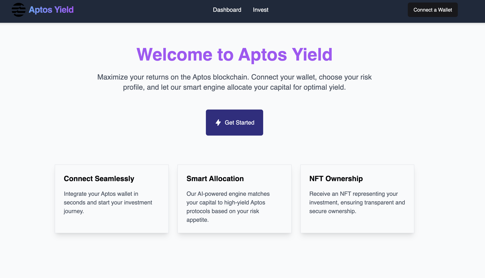
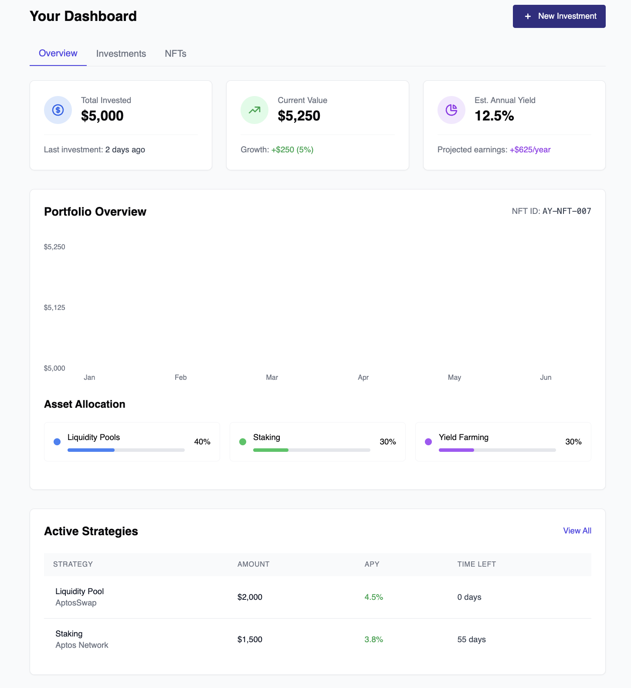
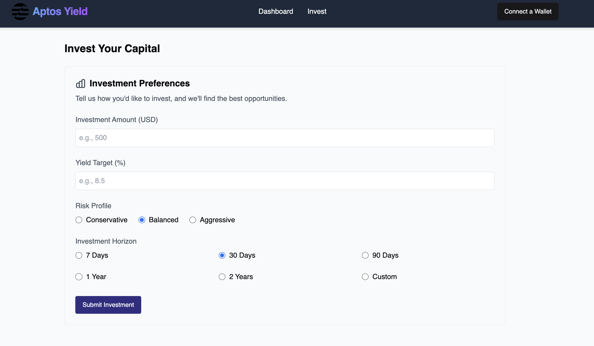
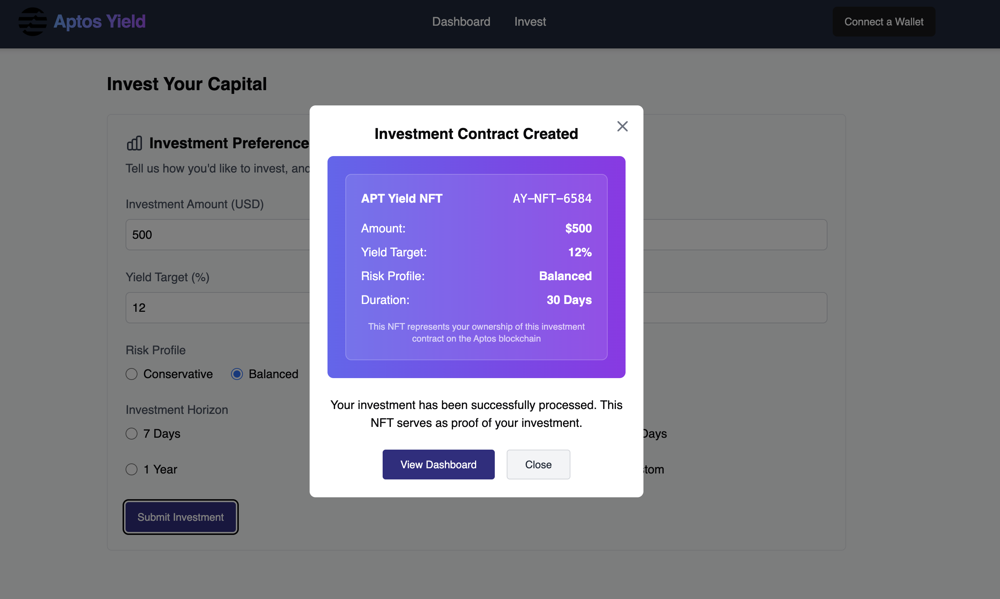

## This app is deployed on the testnet address at:
https://explorer.aptoslabs.com/object/0x09768087ccf44ae11f4007b7c88950662a4c50fed47e134140614d10f08c74ba?network=testnet

## Aptos Yield
The platform that allows retail investors to achieve their yield targets (by taking advantage of aptos protocols). 

Aptos Yield specifically takes advantage of the staking, lending, and farming Aptos protocols available on Aptos, Aptos's unique ability to frequently rebalance portfolios (in the form of Aptos protocol weight) (across protocol addresses) and Aptos's low gas fees.

The allocation engine takes in user capital investment, risk (conservative, balanced, aggressive), yield target, and time horizon (to acheive yield target).

## Demo

## The allocation engine deals with six Aptos Protocols:

1. Liquidswap

LP Yield Range: 5-15% APR
Stable Pair Pools: 3-8% APR
Volatile Pair Pools: 8-25% APR
Boosted Farms: Up to 40% APR during incentive periods

2. Econia

Liquidity Provider Rewards: 4-12% APR
Market Making Rebates: 2-6% additional APR
Concentrated Liquidity Positions: 10-30% APR depending on range settings
Protocol Revenue Sharing: Up to 10% APR for governance token stakers

3. Ditto Finance

Liquid Staking APT: 7-10% APR base yield
dAPT Staking Rewards: 8-12% APR
Governance Incentives: Additional 2-5% APR
Validator Fee Rebates: 0.5-2% APR

4. Abel Finance

Lending Yields:

Major Assets: 2-8% APR
Minor Assets: 6-15% APR

Borrowing Incentives: 1-5% APR in token rewards
Supply-Side Rewards: Additional 3-10% APR during incentive periods
Leveraged Yield Strategies: 10-25% APR (with increased risk)

5. Merkle Trade

Liquidity Provision: 8-20% APR
Trading Fee Revenue: 5-15% APR
Funding Rate Arbitrage: 3-30% APR (highly variable)
Dual Investment Products: 15-40% APR (direction-dependent)

6. Thala Labs

MOD Stablecoin Minting: 5-12% APR
Stability Pool Rewards: 8-15% APR
Concentrated Liquidity Positions: 10-25% APR
Stablecoin LP Rewards: 5-18% APR
Governance Staking: Additional 3-8% APR

## Current Functionality:

1. Deployed on testnet and frontend features complete across homepage, connecting wallet
2. Ability to connect wallet via aptos wallet connect sdk

## Aptos Yield - Demo:
Loom Link: 

## Aptos Yield - Presentation:
Canva Slides Link: https://www.canva.com/design/DAGnoYxRPsk/6vifI4pDpKQivGffh3oEiA/edit?utm_content=DAGnoYxRPsk&utm_campaign=designshare&utm_medium=link2&utm_source=sharebutton

## Next (Future) Developments:
1. Write a basic ML allocation engine for distributing investor capital across the top six Aptos Protocols to achieve yield targets based on risk profile and time horizon.
2. Implement smart contracts to move aptos from aptos wallet to protocol addresses based on allocation engine.
3. Implement smart contract to user aptos wallet address once allocation engine has distributed capital / executed ( NFT is contract of ownership for assets in the protocol addresses)
4. Implement vault mechanism for protocol addresses
5. Implement ability to track protocol addresses (portfolio balance) for providing portfolio balance dashboard

Extra:

## Thanks:
Thanks to Greg and David at Aptos for their help in guiding this idea, and also Phil at EasyA for the spontaneous ideadation session on day one. 

